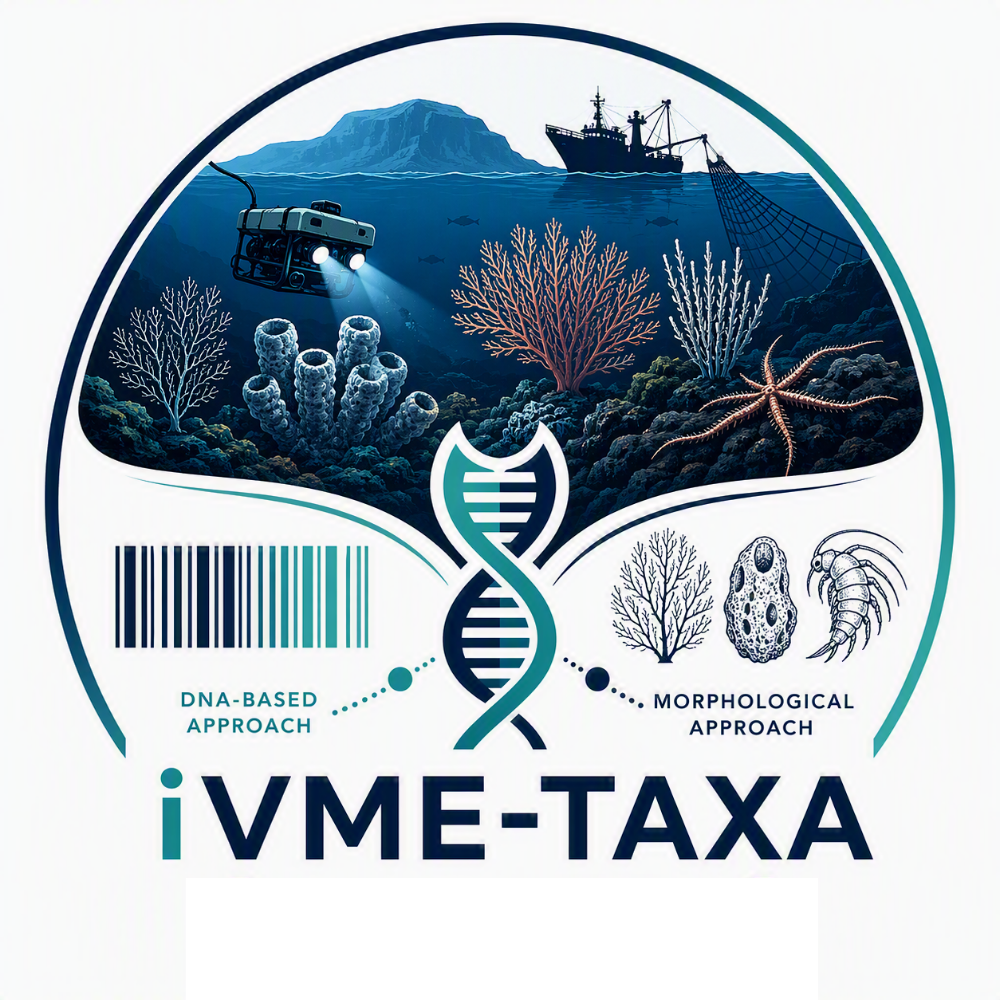

<div id="top">

<!-- HEADER STYLE: COMPACT -->


# iVME-TAXA
<em></em>

<!-- BADGES -->


<em>Built with the tools and technologies:</em>


<br clear="left"/>

## Table of Contents

1. [Table of Contents](#table-of-contents)
2. [Overview](#overview)
3. [Features](#features)
4. [Project Structure](#project-structure)
    4.1. [Project Index](#project-index)
5. [Getting Started](#getting-started)
    5.1. [Prerequisites](#prerequisites)
    5.2. [Installation](#installation)
    5.3. [Usage](#usage)
    5.4. [Testing](#testing)
6. [Roadmap](#roadmap)
7. [Contributing](#contributing)
8. [License](#license)
9. [Acknowledgments](#acknowledgments)

---

## Overview

### **(ENG)**

**iVME-taxa** contains the analysis code supporting the study *"Integrating DNA-Based and Morphological Approaches Improves Biodiversity Characterization of Vulnerable Marine Ecosystems at Flemish Cap."* This repository provides the workflows used to combine classical taxonomy with DNA barcoding (COI and 16S) for the identification of marine invertebrates collected during a 2022 survey of the Flemish Cap, an isolated seamount hosting several Vulnerable Marine Ecosystem (VME) indicator species that remain poorly documented.

The pipeline integrates morphological classification of 434 specimens with molecular assignment against public reference databases, addressing the persistent gaps and inconsistencies in invertebrate DNA barcode records — particularly for understudied deep-sea taxa such as Porifera and Cnidaria. By reconciling morphological and molecular evidence, this project improved taxonomic resolution for 140 specimens and expanded the formal species-level inventory from 88 to 123 (or 133, including open-nomenclature assignments), generating reference data intended to support non-invasive, DNA-based monitoring and conservation strategies for vulnerable deep-sea habitats.

### **(ESP)**

**iVME-taxa** contiene el código de análisis empleado en el estudio *"Integrating DNA-Based and Morphological Approaches Improves Biodiversity Characterization of Vulnerable Marine Ecosystems at Flemish Cap."* Este repositorio reúne los flujos de trabajo utilizados para combinar taxonomía clásica con barcoding de ADN (COI y 16S) en la identificación de invertebrados marinos recolectados durante una campaña de muestreo en 2022 en Flemish Cap, un monte submarino aislado que alberga varias especies indicadoras de Ecosistemas Marinos Vulnerables (VME) todavía poco documentadas.

El pipeline integra la clasificación morfológica de 434 especímenes con la asignación molecular frente a bases de datos públicas de referencia, abordando las brechas e inconsistencias persistentes en los registros de barcodes de ADN para invertebrados, particularmente en taxones de aguas profundas poco estudiados como Porifera y Cnidaria. Al conciliar la evidencia morfológica y molecular, este proyecto mejoró la resolución taxonómica en 140 especímenes y amplió el inventario formal a nivel de especie de 88 a 123 taxones (o 133, incluyendo asignaciones de nomenclatura abierta), generando datos de referencia orientados a apoyar estrategias de monitoreo y conservación no invasivas basadas en ADN para hábitats vulnerables de aguas profundas.

---

## Features

<code>❯ REPLACE-ME</code>

---

## Project Structure

```sh
└── ivme-taxa/
    ├── LICENSE
    ├── README.md
    ├── data
    │   ├── metadata
    │   ├── processed
    │   └── raw
    ├── flemish_cap_integrative_taxonomy.Rproj
    └── scripts
        └── rarefraction_by_stratum.R
```

### Project Index

<details open>
	<summary><b><code>IVME-TAXA/</code></b></summary>
	<!-- __root__ Submodule -->
	<details>
		<summary><b>__root__</b></summary>
		<blockquote>
			<div class='directory-path' style='padding: 8px 0; color: #666;'>
				<code><b>⦿ __root__</b></code>
			<table style='width: 100%; border-collapse: collapse;'>
			<thead>
				<tr style='background-color: #f8f9fa;'>
					<th style='width: 30%; text-align: left; padding: 8px;'>File Name</th>
					<th style='text-align: left; padding: 8px;'>Summary</th>
				</tr>
			</thead>
				<tr style='border-bottom: 1px solid #eee;'>
					<td style='padding: 8px;'><b><a href='https://github.com/mparrondo/ivme-taxa/blob/master/flemish_cap_integrative_taxonomy.Rproj'>flemish_cap_integrative_taxonomy.Rproj</a></b></td>
					<td style='padding: 8px;'>Code>❯ REPLACE-ME</code></td>
				</tr>
				<tr style='border-bottom: 1px solid #eee;'>
					<td style='padding: 8px;'><b><a href='https://github.com/mparrondo/ivme-taxa/blob/master/LICENSE'>LICENSE</a></b></td>
					<td style='padding: 8px;'>Code>❯ REPLACE-ME</code></td>
				</tr>
			</table>
		</blockquote>
	</details>
	<!-- scripts Submodule -->
	<details>
		<summary><b>scripts</b></summary>
		<blockquote>
			<div class='directory-path' style='padding: 8px 0; color: #666;'>
				<code><b>⦿ scripts</b></code>
			<table style='width: 100%; border-collapse: collapse;'>
			<thead>
				<tr style='background-color: #f8f9fa;'>
					<th style='width: 30%; text-align: left; padding: 8px;'>File Name</th>
					<th style='text-align: left; padding: 8px;'>Summary</th>
				</tr>
			</thead>
				<tr style='border-bottom: 1px solid #eee;'>
					<td style='padding: 8px;'><b><a href='https://github.com/mparrondo/ivme-taxa/blob/master/scripts/rarefraction_by_stratum.R'>rarefraction_by_stratum.R</a></b></td>
					<td style='padding: 8px;'>Code>❯ REPLACE-ME</code></td>
				</tr>
			</table>
		</blockquote>
	</details>
</details>

---

## Getting Started

### Prerequisites

This project requires the following dependencies:

- **Programming Language:** R

### Installation

Build ivme-taxa from the source and install dependencies:

1. **Clone the repository:**

    ```sh
    ❯ git clone https://github.com/mparrondo/ivme-taxa/
    ```

2. **Navigate to the project directory:**

    ```sh
    ❯ cd ivme-taxa
    ```

3. **Install the dependencies:**

echo 'INSERT-INSTALL-COMMAND-HERE'

### Usage

Run the project with:

echo 'INSERT-RUN-COMMAND-HERE'

### Testing

Ivme-taxa uses the {__test_framework__} test framework. Run the test suite with:

echo 'INSERT-TEST-COMMAND-HERE'

---

## Roadmap

- [X] **`Task 1`**: <strike>Implement feature one.</strike>
- [ ] **`Task 2`**: Implement feature two.
- [ ] **`Task 3`**: Implement feature three.

---

## Contributing

- **💬 [Join the Discussions](https://github.com/mparrondo/ivme-taxa/discussions)**: Share your insights, provide feedback, or ask questions.
- **🐛 [Report Issues](https://github.com/mparrondo/ivme-taxa/issues)**: Submit bugs found or log feature requests for the `ivme-taxa` project.
- **💡 [Submit Pull Requests](https://github.com/mparrondo/ivme-taxa/blob/main/CONTRIBUTING.md)**: Review open PRs, and submit your own PRs.

<details closed>
<summary>Contributing Guidelines</summary>

1. **Fork the Repository**: Start by forking the project repository to your github account.
2. **Clone Locally**: Clone the forked repository to your local machine using a git client.
   ```sh
   git clone https://github.com/mparrondo/ivme-taxa/
   ```
3. **Create a New Branch**: Always work on a new branch, giving it a descriptive name.
   ```sh
   git checkout -b new-feature-x
   ```
4. **Make Your Changes**: Develop and test your changes locally.
5. **Commit Your Changes**: Commit with a clear message describing your updates.
   ```sh
   git commit -m 'Implemented new feature x.'
   ```
6. **Push to github**: Push the changes to your forked repository.
   ```sh
   git push origin new-feature-x
   ```
7. **Submit a Pull Request**: Create a PR against the original project repository. Clearly describe the changes and their motivations.
8. **Review**: Once your PR is reviewed and approved, it will be merged into the main branch. Congratulations on your contribution!
</details>

<details closed>
<summary>Contributor Graph</summary>
<br>
<p align="left">
   <a href="https://github.com{/mparrondo/ivme-taxa/}graphs/contributors">
      
   </a>
</p>
</details>

---

## License

Ivme-taxa is protected under the [LICENSE](https://choosealicense.com/licenses) License. For more details, refer to the [LICENSE](https://choosealicense.com/licenses/) file.

---

## Acknowledgments

- Credit `contributors`, `inspiration`, `references`, etc.

<div align="right">

[![][back-to-top]](#top)

</div>


[back-to-top]: https://img.shields.io/badge/-BACK_TO_TOP-151515?style=flat-square


---
